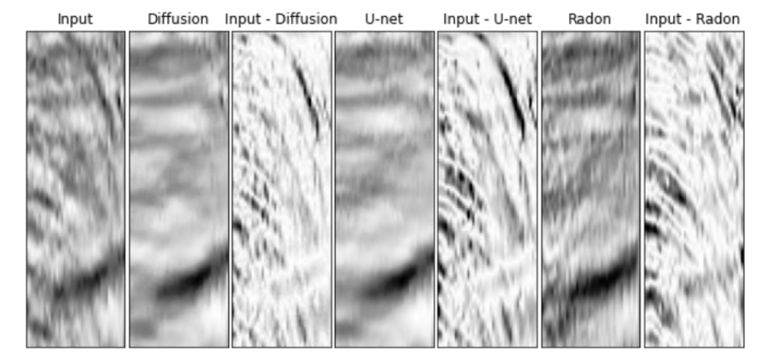
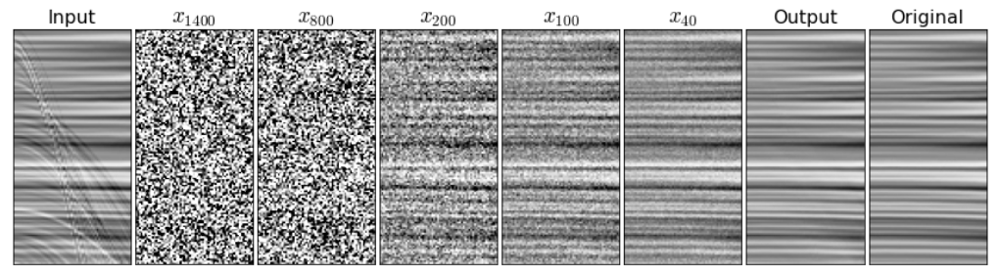
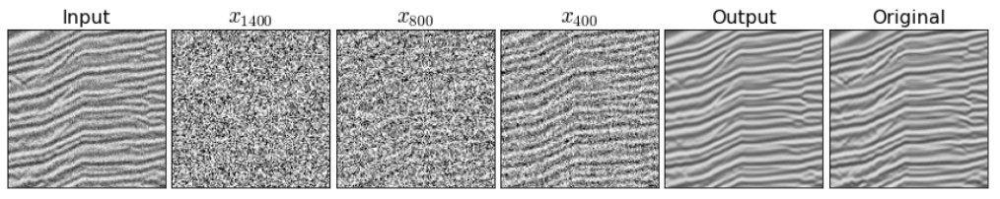
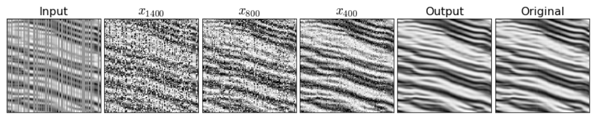

# Deep Diffusion Models for Seismic Processing

PyTorch implementation of **Deep Diffusion Models for Seismic Processing**.

<p align="left"></p>

## Overview
Seismic data processing involves techniques to deal with undesired effects that occur during acquisition and pre-processing. These effects mainly comprise coherent artefacts such as multiples, non-coherent signals such as electrical noise, and loss of signal information at the receivers that leads to incomplete traces. In this work, we introduce diffusion models for three seismic applications: <b>demultiple</b>, <b>denoising</b> and <b>interpolation</b>.

<p align="left"></p>
<p align="left"></p>
<p align="left"></p>


## Testing Code on Demultiples
Download [Pretrained Model (model_test.pt)](https://osf.io/n2bs9/?view_only=77d7313d3f2d44e18dc0ee4005c3bfa4). Run inference on:
```bash
visualization.ipynb
```

## Training Code
Before starting the training you should specify in the run.py file: the <i>mode</i>, the <i>dataset folder</i> and the <i>image size</i>. Then:
```bash
python run.py
```

Note that you might need to installl thrid party libraries.

## Acknowledgement
We acknowledge the code from [lucidrains](https://github.com/lucidrains/denoising-diffusion-pytorch) & [Janspiry](https://github.com/Janspiry/Image-Super-Resolution-via-Iterative-Refinement)
